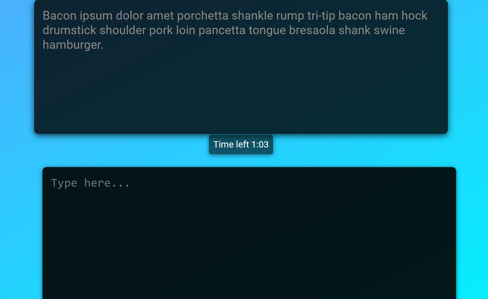
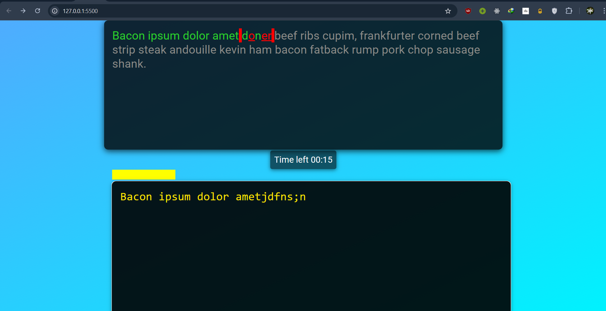
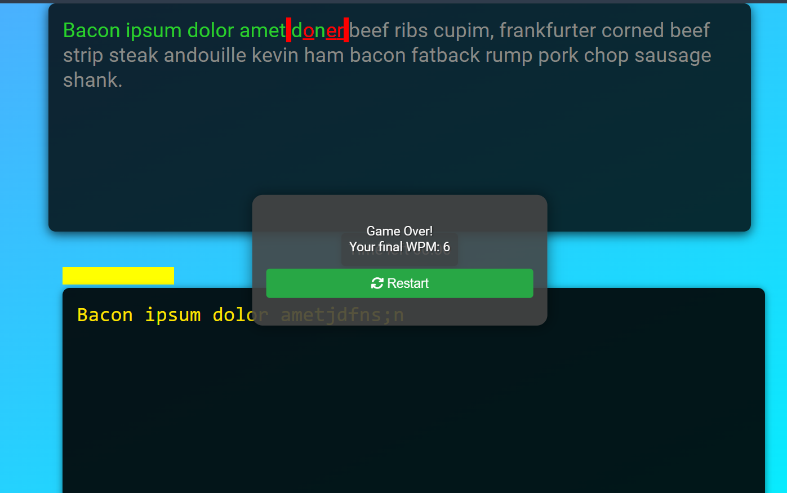

# Typing Game

This is a fun and interactive Typing Game built using HTML, CSS, and JavaScript. The game challenges users to type a given text as accurately and quickly as possible, tracking their speed in Words Per Minute (WPM).

## Table of Contents

- [Features](#features)
- [Screenshots](#screenshots)
- [Getting Started](#getting-started)
- [How to Play](#how-to-play)
- [Technologies Used](#technologies-used)
- [Contact](#contact)

## Features

- **Random Text Generation**: Fetches random text for users to type.
- **Real-time Progress Tracking**: Visual progress bar updates as you type.
- **Time Tracking**: Displays remaining time in a countdown timer.
- **Accuracy Feedback**: Highlights correct and incorrect letters.
- **WPM Calculation**: Calculates and displays Words Per Minute at the end of the game.
- **Responsive Design**: Works on different screen sizes.

## Screenshots

  
*Screenshot of the game start screen.*

  
*Screenshot of typing in progress with progress bar.*

  
*Screenshot of the game over screen showing WPM.*

## Getting Started

To get a local copy up and running, follow these simple steps.

### Prerequisites

- A modern web browser (Google Chrome, Firefox, Safari, etc.)
- Text editor (VS Code, Sublime Text, etc.)

### Installation

1. **Clone the repository:**
   ```bash
   git clone https://github.com/your-username/typing-game.git
   ```
2. **Navigate to the project directory:**
   ```bash
   cd typing-game
   ```
3. **Open `index.html` in your web browser.** You can do this by either dragging and dropping the file into the browser or using the following command in your terminal (for Mac):
   ```bash
   open index.html
   ```
For Windows, you can double-click the file or use:
```bash
start index.html
```
## How to Play

1. **Start the Game**: Open the game in your browser, and you’ll see a random text prompt.
2. **Begin Typing**: Click on the text area and start typing the displayed text.
3. **Timer Starts**: The timer begins as soon as you start typing.
4. **Accuracy Matters**: Type accurately to complete the game. Correct letters will be highlighted in green, while incorrect ones will be highlighted in red.
5. **Game Over**: Once you've finished typing the text or the time runs out, the game will display your Words Per Minute (WPM).
6. **Restart the Game**: Click the "Restart" button to play again!

## Technologies Used

- **HTML5**: For structuring the game layout.
- **CSS3**: For styling and enhancing the visual appeal.
- **JavaScript (ES6)**: For game logic and dynamic updates.

## Contact

**Nebiyu Musbah Yesuf**  
- GitHub: [neba378](https://github.com/neba378)
- LinkedIn: [Your LinkedIn Profile](https://linkedin.com/in/nebiyu-musbah)
- Email: [nebiyumusbah378@gmail.com](mailto:nebiyumusbah378@gmail.com)

